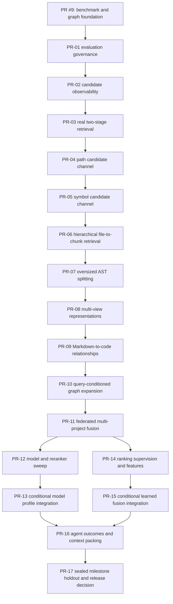

# Tessera Retrieval Quality Program — Master Plan

**Date:** 2026-07-14

**Status:** Active; PR-01 and PR-02 complete, PR-03 next

**Integration target:** `develop` at foundation commit `35800ce`

**Evidence baseline:** [PR #9](https://github.com/danieliser/tessera/pull/9), [competitive report](../../benchmark-competitive-2026-07-14.md), [benchmark expansion issue #11](https://github.com/danieliser/tessera/issues/11)

**Program rule:** one hypothesis and one independently reviewable result per pull request

## Objective

Improve Tessera's code, document, and cross-source retrieval on unseen repositories without tuning product behavior to the visible benchmark. The program prioritizes structural retrieval improvements before model or ranking-policy changes, measures each change independently, and merges only conclusive, regression-safe work into the integration branch.

The existing 58-query Flask/Next.js benchmark has already informed engineering hypotheses. It is therefore a diagnostic and regression suite, not an unbiased holdout and not a source of production constants. Its post-hoc code-only reranker score is an oracle upper bound, not a routing design.

## Non-negotiable evaluation rules

1. **No benchmark-specific behavior.** Do not add query strings, repository names, language gates, filename coefficients, synonym lists, or model routes because they improve the visible suite.
2. **Repository-level separation.** Development and holdout repositories must not overlap. A query-level split within one repository is insufficient because symbols, naming conventions, and architecture leak across the split.
3. **Declare the hypothesis first.** Every quality PR records its primary metric, expected mechanism, operational budget, and regression tolerances before treatment results are run.
4. **Measure channels separately.** Report candidate Recall@K before ranking metrics. A reranker cannot repair an absent candidate.
5. **Macro-average first.** Primary summaries are macro-averaged by repository, then broken down by language and content type so one large repository cannot dominate.
6. **Do not repeatedly inspect the holdout.** Use the multi-repository development corpus for PR decisions. Run a sealed holdout only for a frozen milestone candidate; after inspection, retire that holdout into the regression suite and replace it.
7. **Prefer invariant tests.** Translate an observed failure into a general property or synthetic fixture, such as duplicate-pool starvation or ambiguous imports, rather than copying the failing benchmark query into product logic.
8. **Negative results are valid outcomes.** Close or defer an inconclusive experiment. Do not search weights or conditions until the visible cases pass.

## What “conclusive” means

Each PR must identify one of these evidence classes in its description before implementation:

| Evidence class | Required merge evidence |
|---|---|
| Deterministic correctness | A red/green invariant test demonstrating the defect and fix, the full relevant suite passing, and no changed retrieval defaults unless quality evidence also passes. |
| Retrieval quality | Same-corpus paired baseline/treatment runs; a predeclared primary metric; a 95% paired bootstrap interval on the macro per-repository delta; no statistically credible protected-segment regression beyond the predeclared tolerance. |
| Performance/operations | Repeated warm and cold measurements; predeclared p50/p95, memory, index-size, and indexing-time budgets; no correctness regression. |
| Model/default selection | A Pareto result across quality, latency, memory, index size, license, and deployment complexity on development repositories, followed by the milestone holdout gate before release. |
| End-to-end agent behavior | Repeated tasks with blinded expected evidence; correctness, file/tool usage, time, tokens, and cost; paired comparison against the current compact `explore` baseline. |

If a retrieval sample is too small for the declared interval or segment analysis, the outcome is **inconclusive**, not positive. Add independently authored data rather than weakening the gate.

## Benchmark tiers

| Tier | Purpose | Contents | When it runs | Can tune against it? |
|---|---|---|---|---|
| A — deterministic | Correctness and invariants | Unit, integration, graph collision, schema, migration, and property tests | Every commit/PR | Yes, to satisfy the documented invariant |
| B — development | Choose implementations | Multiple repositories per supported language family; code, Markdown, and cross-source queries | Before/after each quality PR | Yes |
| C — sealed holdout | Milestone promotion | Unseen repositories and independently authored labels | Once per frozen milestone candidate | No |
| D — agent tasks | User outcome | Repeated repository questions and change tasks | Baseline, milestones, and release candidates | Development tasks yes; sealed tasks no |
| Legacy regression | Detect known regressions | The visible Flask/Next.js suite and prior PM benchmarks | After development results, never as the selection metric | No |

Required retrieval reporting:

- Candidate Recall@10, @20, @50, and the configured rerank pool.
- File-level MRR@10, nDCG@10, Top-1/3/10, and duplicate-file rate.
- Chunk-level relevance for context assembly changes.
- Macro results per repository, language, and `code` / `document` / `cross` content class.
- Indexing time, query p50/p95, peak memory, persistent index size, and model/license metadata.
- Channel contribution and ablation: content lexical, semantic, path, symbol, graph, and reranker.

## Pull-request and merge protocol

- Each numbered task below gets its own branch, commit series, and PR. Program IDs are stable; GitHub PR numbers are filled in when opened.
- Branch from the latest passing `develop`, or from the immediately preceding task branch when a stack is required. A stacked PR targets its parent branch until the parent merges, then rebases/retargets to `develop`.
- Do not combine cleanup, dependency upgrades, formatting sweeps, model changes, or unrelated fixes with an experiment.
- Keep experimental behavior behind an explicit flag or non-default profile until its promotion PR passes.
- Attach machine-readable before/after output and the exact commands, revisions, model IDs, seeds, and warm/cold state to every quality PR.
- A passing task may be squash-merged into `develop` without owner confirmation when all declared gates pass, CI is green, there are no unresolved review findings, and the change stays within this plan.
- Never auto-merge an inconclusive result, a protected-segment regression, a storage migration without rollback, a new non-commercial model default, or any PR directly into `main`.
- Promotion from `develop` to `main` is a separate milestone decision after the sealed holdout and agent-task gates.

## Dependency map

PR-12/13 and PR-14/15 are parallel optional branches after PR-11. Neither model promotion nor learned fusion is required if the earlier structural work is sufficient.

## Master task list

| ID | Task | Depends on | Size | Status | PR |
|---|---|---|---|---|---|
| CP-0 | Establish the integration branch and retarget open work | Owner decision | S | Complete | PR #9 / `35800ce` |
| PR-01 | Evaluation governance and repository-level corpora | PR #9 | M | Complete | PR #14 |
| PR-02 | Candidate tracing and benchmark observability | PR-01 | M | Complete | PR #15 |
| PR-03 | Real two-stage retrieval and rerank pool | PR-02 | M | Todo | — |
| PR-04 | Searchable file/path candidate channel | PR-03 | M | Todo | — |
| PR-05 | Searchable symbol/signature candidate channel | PR-04 | M | Todo | — |
| PR-06 | Hierarchical file-to-chunk retrieval | PR-05 | L | Todo | — |
| PR-07 | Recursive oversized AST splitting | PR-06 | M | Todo | — |
| PR-08 | Multi-view chunk representations | PR-07 | L | Todo | — |
| PR-09 | Markdown-to-code relationship channel | PR-08 | M | Todo | — |
| PR-10 | Query-conditioned typed graph expansion | PR-09 | L | Todo | — |
| PR-11 | Federated multi-project fusion | PR-10 | M | Todo | — |
| PR-12 | Model/reranker sweep harness and experiment | PR-11 | M | Todo | — |
| PR-13 | Conditional model/reranker profile integration | PR-12 | S-M | Conditional | — |
| PR-14 | Ranking supervision corpus and feature capture | PR-11 | L | Todo | — |
| PR-15 | Conditional learned fusion ranker | PR-14 | L | Conditional | — |
| PR-16 | Agent-task evaluation and context packing | PR-13 and/or PR-15 | L | Todo | — |
| PR-17 | Sealed milestone holdout and release decision | PR-16 | M | Todo | — |

## Task specifications

### CP-0 — Establish the integration branch

**Completed 2026-07-14:** `origin/develop` was created from the then-current `origin/main` tip (`169dddc`) without using the stale local branch. PR #9 was retargeted, revalidated, and squash-merged as foundation commit `35800ce`.

- [x] Confirm `develop` as the integration branch.
- [x] Create the remote branch from the current remote main tip without pushing the stale local branch.
- [x] Retarget, revalidate, and merge PR #9 into `develop` as the program foundation.

**Gate:** Passed. The remote integration target exists, PR #9 is merged, and no existing branch history was rewritten.

### PR-01 — Evaluation governance and repository-level corpora

**Goal:** Make it impossible to confuse development, regression, and sealed holdout data.

- [x] Add versioned dataset manifests with repository URL, pinned revision, license, language/content coverage, label provenance, and split.
- [x] Mark the existing Flask/Next.js and PM suites as `legacy_regression` in metadata and reports.
- [x] Add several development repositories across supported language families, including Markdown and mixed document/code cases.
- [x] Define an encrypted, private, or otherwise inaccessible sealed-holdout manifest and a rotation procedure.
- [x] Add macro-per-repository metrics, paired bootstrap intervals, protected-segment reporting, and machine-readable run metadata.
- [x] Reframe issue #12: content/language routing remains only a hypothesis until broad repository-level evidence exists.

**Excludes:** Any product ranking change.

**Gate:** Passed on PR #14. All eight public repository revisions and labels
validate, metric-recomputation tests pass, and the clean six-repository baseline
at `c85a186` is recorded in
`benchmarks/development-baseline-2026-07-14.json`.
No holdout repository identity or label is present in the public tree.

### PR-02 — Candidate tracing and benchmark observability

**Goal:** Explain why every result was or was not eligible for ranking.

- [x] Record candidate provenance, source-channel rank/score, deduplication, shortcut decisions, graph expansion, rerank-pool inclusion, and final rank.
- [x] Emit structured traces without changing default result ordering.
- [x] Add per-channel and union Recall@K plus duplicate/file-diversity metrics.
- [x] Add cross-project source attribution and calibration diagnostics.
- [x] Keep normal search output compact; expose traces only through benchmark/debug surfaces.

**Excludes:** New candidate channels or score changes.

**Gate:** Bit-for-bit or order-equivalent default results, bounded tracing overhead, and complete attribution for deterministic fixtures.

**Passed on PR #15:** all 300 paired traced/untraced development searches
were exactly equal; all 30 frozen-baseline ranks and ordered file lists were
unchanged; attribution was complete; tracing added 0.8976 ms at p95 (1.1806x)
and produced at most 48,898 bytes per query. Focused validation passed 544
tests, lint, and strict docs. See
[the PR-02 report](../../benchmark-candidate-tracing-2026-07-14.md).

### PR-03 — Real two-stage retrieval and rerank pool

**Goal:** Decouple the candidate budget from the user-visible result limit.

- [x] Compute a candidate budget before per-project retrieval when a reranker is active.
- [x] Retrieve enough channel candidates to populate that budget instead of requesting only the final `limit`.
- [x] Prevent duplicate chunks from one file from starving the reranker while preserving an explicit way to return multiple useful chunks from a selected file.
- [x] Pass structured candidate text to the reranker, including stable path/symbol context where available.
- [x] Add red/green tests proving a requested result outside the first output page can be promoted by the reranker.
- [x] Predeclare the candidate budget from latency/memory constraints; do not choose it on the legacy benchmark.

**Gate:** The reranker receives the declared unique candidate pool, invariant tests fail before/pass after, development-corpus quality is non-negative, and p95 remains within the declared budget.

**Experiment rejected:** Both the initial and context-conserving treatments
failed the predeclared latency gates. The remediation retained only a small,
uncertain macro MRR gain (`+0.008095`) and had a large Hono regression; hard
coverage-first selection independently reduced macro MRR. PR-03 remains
[unmerged draft PR #16](https://github.com/danieliser/tessera/pull/16). See
[the experiment declaration](PR-03.md) and
[full result](../../benchmark-two-stage-retrieval-2026-07-14.md). Cross-encoder
throughput/model selection and relevance-aware diversity must proceed through
[issue #17](https://github.com/danieliser/tessera/issues/17),
[issue #12](https://github.com/danieliser/tessera/issues/12), and
[issue #18](https://github.com/danieliser/tessera/issues/18); PR-04 does not
depend on this rejected production path.

### PR-04 — Searchable file/path candidate channel

**Goal:** Retrieve files named or located like the query even when their body lacks the terms.

- [ ] Add an independently searchable path/module index; do not rely on the current `file_path UNINDEXED` FTS column.
- [ ] Index exact path, basename, extensionless basename, directory/module tokens, and camel/snake/kebab aliases.
- [ ] Produce a ranked candidate list fused through the standard channel interface.
- [ ] Cover duplicate basenames, generated/vendor paths, punctuation, case, and path-only positives.
- [ ] Record index-size and indexing-time overhead.

**Excludes:** Filename score coefficients applied after fusion.

**Gate:** Generic path-only fixtures become retrievable, development candidate Recall@K improves beyond the paired interval, and non-path queries/protected segments do not regress.

### PR-05 — Searchable symbol/signature candidate channel

**Goal:** Retrieve definitions and containing files directly from symbol evidence.

- [ ] Index qualified/unqualified names, aliases, exported names, signatures, and enclosing scope.
- [ ] Normalize identifier forms without discarding the exact token.
- [ ] Return symbol-backed file/chunk candidates before fusion instead of applying a post-merge boost.
- [ ] Test collisions, overloads, aliases, scopes, and same-name definitions across files/languages.
- [ ] Preserve exact graph-resolution precision when binding candidates to symbol IDs.

**Excludes:** A tuned scalar symbol boost.

**Gate:** Symbol-only fixtures and multi-repository development queries improve candidate recall with no ambiguous-target precision regression.

### PR-06 — Hierarchical file-to-chunk retrieval

**Goal:** Select relevant files first, then the best evidence chunks within them.

- [ ] Define stable file-level candidates aggregated from content, path, symbol, semantic, and graph evidence.
- [ ] Rerank/select files before choosing one or more evidence chunks per file.
- [ ] Add configurable diversity and per-file context budgets without hiding relevant second chunks.
- [ ] Measure both file-level ranking and chunk-level context relevance.
- [ ] Preserve source citations and line ranges through both stages.

**Gate:** Lower duplicate-file crowding, positive file-level development metrics, non-negative chunk relevance, and bounded latency/index overhead.

### PR-07 — Recursive oversized AST splitting

**Goal:** Ensure every code chunk presented to an embedder fits its declared token budget while retaining structural context.

- [ ] Measure budgets with the active model tokenizer rather than non-whitespace characters alone.
- [ ] Recursively split oversized definitions at statement/block AST boundaries.
- [ ] Carry the enclosing qualified name and signature into child metadata without duplicating large bodies.
- [ ] Add safe fallbacks for parser failures and unusually large leaf nodes.
- [ ] Cover Python, TypeScript/JavaScript, PHP, Go, Swift, and Ruby fixtures.

**Gate:** No indexed embedding input exceeds its declared budget, reconstructed line coverage is complete/non-overlapping except intentional context, parser fixtures pass, and development retrieval does not regress.

### PR-08 — Multi-view chunk representations

**Goal:** Let different query types find the same code without polluting one embedding with every metadata field.

- [ ] Define separate views for path/module, qualified symbol/signature, docstring/comment, and implementation body.
- [ ] Map all views back to one stable source chunk/file identity.
- [ ] Compare separate-vector retrieval, sparse metadata retrieval, and single prefixed text as explicit ablations.
- [ ] Bound index multiplication, update/migration cost, and cache invalidation.
- [ ] Version representation schemas so indexes rebuild safely.

**Gate:** A predeclared representation wins on development repositories across more than one language family, meets storage/latency budgets, and has a tested rebuild/rollback path.

### PR-09 — Markdown-to-code relationship channel

**Goal:** Improve cross-source questions while preserving Tessera's already-strong document retrieval.

- [ ] Parse Markdown/MDX/RST heading breadcrumbs, relative links, code fences, symbol mentions, and source-file references into typed relationships.
- [ ] Resolve only high-confidence in-project targets; retain unresolved text without guessing.
- [ ] Add document-to-code and code-to-document candidates as a separately traceable channel.
- [ ] Test broken links, duplicate symbol mentions, generated docs, and moved files.
- [ ] Keep document-only ordering as a protected segment.

**Gate:** Cross-source development metrics improve with no credible document-only regression and exact-link precision meets the predeclared threshold.

### PR-10 — Query-conditioned typed graph expansion

**Goal:** Use Tessera's import-aware cross-file graph for local retrieval without restoring global centrality noise.

- [ ] Seed only from resolvable query identifiers/modules or high-confidence initial candidates.
- [ ] Expand a bounded number of hops across typed imports, calls, extends/implements, exports/re-exports, events, and document links.
- [ ] Preserve edge type, direction, distance, and resolution confidence as ranking features.
- [ ] Add negative and ambiguous fixtures that must not expand.
- [ ] Compare bounded expansion against graph-disabled search and global PPR as an ablation.

**Excludes:** Re-enabling global PPR or tuning graph weights on the legacy suite.

**Gate:** Multi-hop development queries improve, exact-edge precision remains protected, and non-identifier/conceptual queries do not receive noisy expansion.

### PR-11 — Federated multi-project fusion

**Goal:** Make collection/global search comparable and fair across independently searched projects.

- [ ] Replace direct sorting of per-project rank-fusion scores with an explicit global/federated merge.
- [ ] Handle projects with different sizes, channel availability, score distributions, and result counts.
- [ ] Deduplicate shared/generated files and preserve project provenance.
- [ ] Add adversarial fixtures where the relevant project is not first in enumeration order.
- [ ] Report per-project candidate quotas and final representation.

**Gate:** Order-invariance fixtures pass, multi-project development metrics improve or remain equivalent, and no project-size/source-order bias remains detectable.

### PR-12 — Model and reranker sweep harness

**Goal:** Compare model families after structural candidate gaps are fixed, without changing defaults.

- [ ] Standardize embedding/reranker adapters, instructions, truncation, dimensions, quantization, and warm/cold measurement.
- [ ] Evaluate current baselines plus code-specific, general multilingual, and token-level late-interaction candidates.
- [ ] Include supported-language, Markdown, and cross-source segments; do not route by language unless a later independent policy proves stable.
- [ ] Record licenses, download size, memory, throughput, context limits, index compatibility, and deployment dependencies.
- [ ] Produce a machine-readable Pareto report and retain all negative results.

**Excludes:** Any default/profile promotion.

**Gate:** Reproducible runs on development repositories and at least one clearly characterized Pareto frontier. If no candidate dominates or fills a distinct deployment tier, PR-13 is skipped.

### PR-13 — Conditional model/reranker profile integration

**Goal:** Integrate only a model/profile candidate supported by broad development evidence, without consuming the sealed holdout or changing the release default.

- [ ] Select the candidate and deployment tier from the predeclared PR-12 development evidence.
- [ ] Add explicit profile/version pinning, migrations/reindex guidance, offline fallback, and license notice.
- [ ] Preserve user force/disable/override controls.
- [ ] Keep the candidate non-default or explicitly development-only until PR-17.
- [ ] Record the frozen candidate configuration for the later milestone stack; do not inspect sealed labels here.

**Owner input required:** Any non-commercial license, paid API, material memory/download increase, or quality/latency tradeoff without a dominant choice.

**Gate:** Pareto development evidence and operational acceptance. Otherwise close without integration. Release-default promotion is reserved for PR-17.

### PR-14 — Ranking supervision corpus and feature capture

**Goal:** Accumulate enough repository-diverse evidence to justify learning fusion later.

- [ ] Build versioned weak-supervision adapters for issue/PR text to changed files, commit messages to diffs, documentation links, and exact symbol references.
- [ ] Sample hard negatives from sibling symbols, same-name files, nearby modules, and top incorrect candidates.
- [ ] Keep repository-level train/development separation and provenance for every label.
- [ ] Export simple, model-agnostic features: channel ranks/scores, exact matches, chunk/file attributes, graph evidence, and duplication/diversity.
- [ ] Audit label noise and leakage before training anything.

**Excludes:** A learned production ranker.

**Gate:** Data-quality report passes, leakage checks are clean, and the corpus is large/diverse enough for the predeclared model class. Otherwise PR-15 remains deferred.

### PR-15 — Conditional learned fusion ranker

**Goal:** Replace fixed global fusion only if a small, interpretable ranker generalizes by repository.

- [ ] Start with regularized linear/logistic or monotonic tree ranking before neural fusion.
- [ ] Train only on PR-14 training repositories and choose hyperparameters only on its development repositories.
- [ ] Ablate each feature family and compare against unweighted/fixed RRF.
- [ ] Add a deterministic fallback when the model is absent, incompatible, or low confidence.
- [ ] Version the ranker and feature schema independently of embedding indexes.

**Gate:** Paired development evidence across repository/language/content segments, operational budget, and explainable ablations. Merge behind an explicit development feature flag; release activation is reserved for PR-17. Otherwise retain fixed fusion.

### PR-16 — Agent-task evaluation and context packing

**Goal:** Confirm that retrieval improvements produce better agent outcomes rather than only better file ranks.

- [ ] Expand issue #11's agent track with blinded questions and change tasks across unseen repositories.
- [ ] Compare compact `explore`, advanced tools, and iterative retrieve-inspect-expand workflows.
- [ ] Score answer/change correctness, evidence citations, unnecessary file reads, tool adoption, calls, time, tokens, and cost.
- [ ] Tune context packing only on development tasks: file summaries, symbol outlines, evidence chunks, graph neighbors, and token budgets.
- [ ] Run repeated trials with fixed model/version/settings and report variance.

**Gate:** Statistically and practically meaningful agent-outcome improvement without unacceptable cost/latency. This gates `develop` promotion to a release candidate; it does not justify retuning earlier retrieval components on sealed tasks.

### PR-17 — Sealed milestone holdout and release decision

**Goal:** Evaluate one frozen, fully integrated milestone stack exactly once and decide whether it is eligible to move from `develop` toward `main`.

- [ ] Freeze code, configurations, model/profile choices, thresholds, and the primary/guardrail metrics before opening the holdout.
- [ ] Run deterministic, operational, retrieval, and agent-task holdout tracks without inspecting intermediate labels or changing the stack.
- [ ] Publish the complete result, including negative segments, confidence intervals, costs, and deviations from the preregistered protocol.
- [ ] If the gate passes, enable only the predeclared release defaults and prepare the `develop` → `main` promotion.
- [ ] If the gate fails, do not patch against revealed cases. Archive the holdout into legacy regression, keep current release defaults, diagnose only at the failure-class level, and commission a fresh sealed holdout for the next milestone.

**Owner input required:** Final release promotion and any accepted tradeoff.

**Gate:** All preregistered primary, protected-segment, operational, and agent-outcome criteria pass. This is the program's only sealed-holdout opening for the milestone.

## Protected segments and rollback requirements

Every PR must explicitly protect:

- Document-only retrieval, especially Markdown headings and section context.
- Python, TypeScript/JavaScript, PHP, Go, Swift, and Ruby fixtures that the changed subsystem supports.
- Exact import/alias/re-export graph precision.
- Keyword-only/offline fallback behavior.
- Compact MCP tool compatibility and stable result identifiers/citations.
- Index migration, incremental reindex, and unchanged-file behavior when schema or representation changes.

Default-changing PRs require a feature flag or immediately reversible profile/config switch. Schema-changing PRs require version detection, clean rebuild instructions, and a tested downgrade or discard-and-rebuild path.

## Owner checkpoints

The implementer should continue autonomously and ping the owner only at these points:

1. **CP-0 complete:** `origin/develop` exists and PR #9 landed there as `35800ce`.
2. **Corpus approval:** repository/license constraints or private repositories are needed for the development/holdout sets.
3. **Operational budget:** product limits for local model download, memory, index size, p95 latency, and optional paid APIs are not already documented.
4. **Tradeoff:** no Pareto-dominant model/algorithm exists and the choice materially changes product cost or deployment.
5. **License/external service:** a candidate is non-commercial, sends code externally, or requires new credentials/billing.
6. **Regression exception:** a proposed gain requires accepting a protected-segment or compatibility regression.
7. **Release promotion:** the frozen milestone is ready for PR-17's single sealed-holdout opening and the `develop` → `main` decision.

Routine implementation choices, conclusive negative experiments, safe rollbacks, and passing merges to `develop` do not require owner input.

## Program completion criteria

The program is complete for the current milestone when:

- [ ] Candidate and ranking bottlenecks are observable end to end.
- [ ] Structural PRs through PR-11 have each produced a conclusive merge or documented negative result.
- [ ] Optional model/learned-ranking branches have been promoted or explicitly skipped based on evidence.
- [ ] The frozen stack passes deterministic, development, sealed holdout, operational, and agent-task gates.
- [ ] The visible legacy benchmark has not been used to select constants or routes and shows no unexplained regression.
- [ ] All merged work is documented with reproducible commands and machine-readable artifacts.
- [ ] The sealed holdout is retired and a fresh holdout is prepared for the next milestone.
